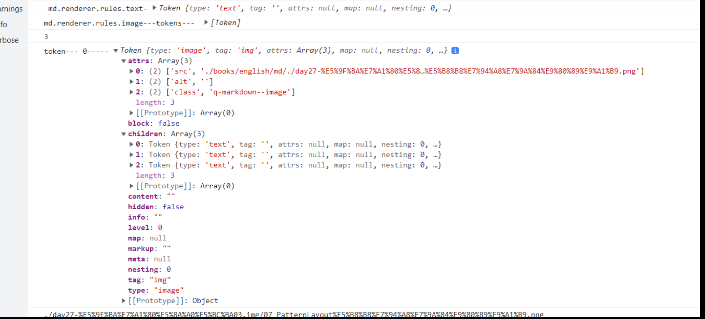

## C语言类型强制转换

## 目录

1. 1 [基本介绍](https://baike.baidu.com/item/C语言类型强制转换/7593367?fr=aladdin#1)
2. 2 [注意事项](https://baike.baidu.com/item/C语言类型强制转换/7593367?fr=aladdin#2)
3. 3 [相关内容](https://baike.baidu.com/item/C语言类型强制转换/7593367?fr=aladdin#3)

## 基本介绍

[编辑](javascript:;)[ 语音](javascript:;)

[强制类型转换](https://baike.baidu.com/item/强制类型转换)是通过类型转换运算来实现的。其一般形式为：（类型说明符）（[表达式](https://baike.baidu.com/item/表达式)）其功能是把表达式的运算结果[强制转换](https://baike.baidu.com/item/强制转换)成类型说明符所表示的类型。自动转换是在源类型和目标类型兼容以及目标类型广于源类型时发生一个类型到另一类的转换。例如： (float) a 把a转换为浮点型，(int)(x+y) 把x+y的结果转换为[整型](https://baike.baidu.com/item/整型)。在使用强制转换时应注意以下问题：

## 注意事项

[编辑](javascript:;)[ 语音](javascript:;)

1.类型说明符和[表达式](https://baike.baidu.com/item/表达式)都必须加括号（单个变量可以不加括号），如把(int)(x+y)写成(int)x+y则成了把x转换成int型之后再与y相加了。

2.无论是[强制转换](https://baike.baidu.com/item/强制转换)或是自动转换，都只是为了本次运算的需要而对变量的数据长度进行的临时性转换，而不改变数据说明时对该变量定义的类型。

例1：


```
C 强制类型转换

强制类型转换是把变量从一种类型转换为另一种数据类型。例如，如果您想存储一个 long 类型的值到一个简单的整型中，您需要把 long 类型强制转换为 int 类型。您可以使用强制类型转换运算符来把值显式地从一种类型转换为另一种类型，如下所示：

(type_name) expression

请看下面的实例，使用强制类型转换运算符把一个整数变量除以另一个整数变量，得到一个浮点数：

#include <stdio.h>

main()
{
   int sum = 17, count = 5;
   double mean;

   mean = (double) sum / count;
   printf("Value of mean : %f\n", mean );

}

当上面的代码被编译和执行时，它会产生下列结果：

Value of mean : 3.400000

这里要注意的是强制类型转换运算符的优先级大于除法，因此 sum 的值首先被转换为 double 型，然后除以 count，得到一个类型为 double 的值。

类型转换可以是隐式的，由编译器自动执行，也可以是显式的，通过使用强制类型转换运算符来指定。在编程时，有需要类型转换的时候都用上强制类型转换运算符，是一种良好的编程习惯。
整数提升

整数提升是指把小于 int 或 unsigned int 的整数类型转换为 int 或 unsigned int 的过程。请看下面的实例，在 int 中添加一个字符：

#include <stdio.h>

main()
{
   int  i = 17;
   char c = 'c'; /* ascii 值是 99 */
   int sum;

   sum = i + c;
   printf("Value of sum : %d\n", sum );

}

当上面的代码被编译和执行时，它会产生下列结果：

Value of sum : 116

在这里，sum 的值为 116，因为编译器进行了整数提升，在执行实际加法运算时，把 'c' 的值转换为对应的 ascii 值。
常用的算术转换

常用的算术转换是隐式地把值强制转换为相同的类型。编译器首先执行整数提升，如果操作数类型不同，则它们会被转换为下列层次中出现的最高层次的类型：
Usual Arithmetic Conversion

常用的算术转换不适用于赋值运算符、逻辑运算符 && 和 ||。让我们看看下面的实例来理解这个概念：

#include <stdio.h>

main()
{
   int  i = 17;
   char c = 'c'; /* ascii 值是 99 */
   float sum;

   sum = i + c;
   printf("Value of sum : %f\n", sum );

}

当上面的代码被编译和执行时，它会产生下列结果：

Value of sum : 116.000000

在这里，c 首先被转换为整数，但是由于最后的值是 double 型的，所以会应用常用的算术转换，编译器会把 i 和 c 转换为浮点型，并把它们相加得到一个浮点数。
```

### sxsa


