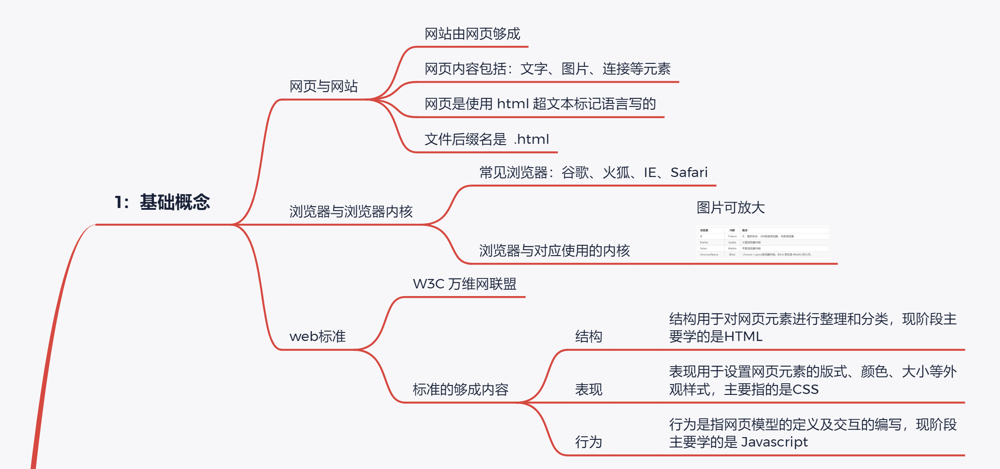
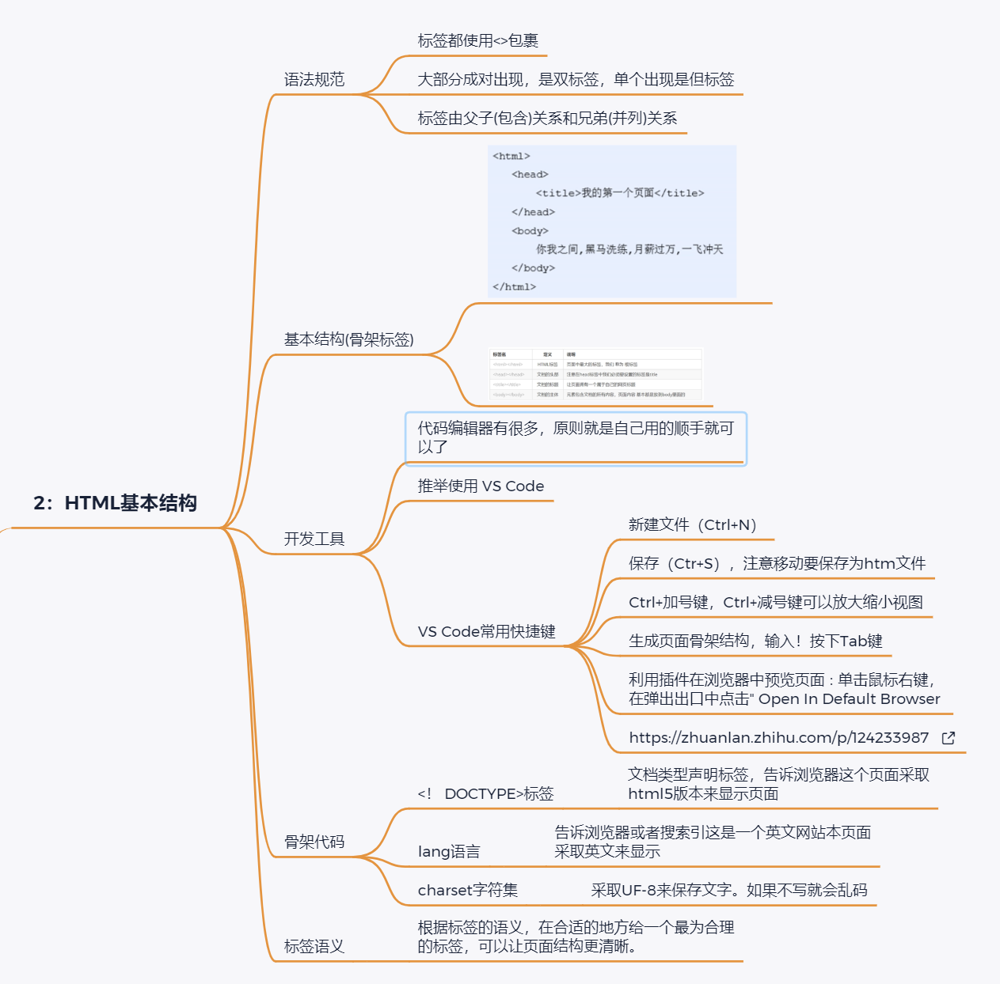
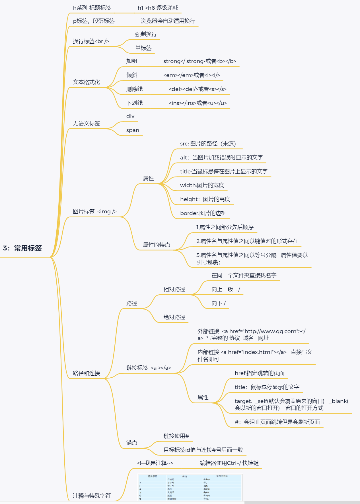
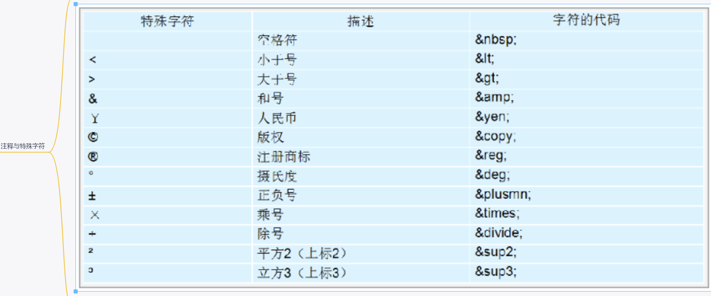
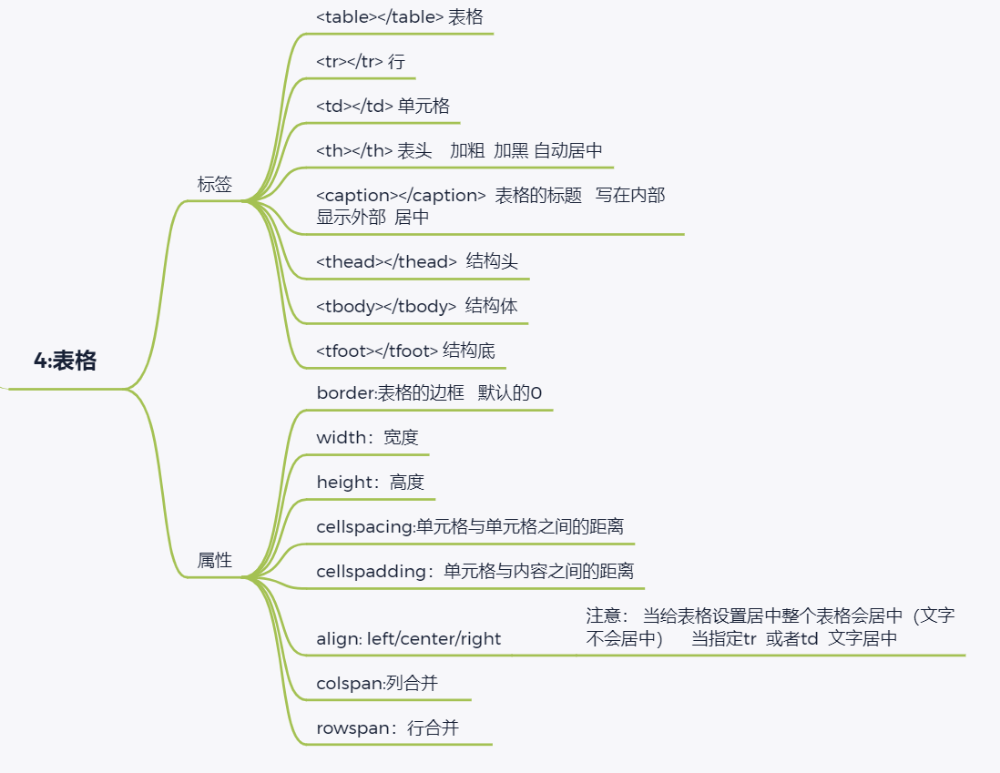
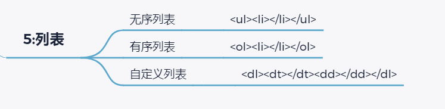

> # **HTML基础**



> 1：**基础概念**
> 	`网页与网站`
> 		网站由网页够成
> 		网页内容包括：文字、图片、连接等元素
> 		网页是使用 html 超文本标记语言写的
> 		文件后缀名是  .html
> 	`浏览器与浏览器内核`
> 		常见浏览器：谷歌、火狐、IE、Safari
> 		浏览器与对应使用的内核
> 			图片可放大
> 	`web标准`
> 		W3C 万维网联盟
> 		标准的够成内容
> 			结构
> 				结构用于对网页元素进行整理和分类，现阶段主要学的是HTML
> 			表现
> 				表现用于设置网页元素的版式、颜色、大小等外观样式，主要指的是CSS
> 			行为
> 				行为是指网页模型的定义及交互的编写，现阶段主要学的是 Javascript




> **2：HTML基本结构**
> 	`语法规范`
> 		标签都使用<>包裹
> 		大部分成对出现，是双标签，单个出现是但标签
> 		标签由父子(包含)关系和兄弟(并列)关系
> 	`基本结构(骨架标签)`

> ```
> 开发工具
> 	代码编辑器有很多，原则就是自己用的顺手就可以了
> 	推举使用 VS Code
> 	VS Code常用快捷键
> 		新建文件（Ctrl+N）
> 		保存（Ctr+S），注意移动要保存为htm文件
> 		Ctrl+加号键，Ctrl+减号键可以放大缩小视图
> 		生成页面骨架结构，输入！按下Tab键
> 		利用插件在浏览器中预览页面∶单击鼠标右键，在弹出出口中点击" Open In Default Browser
> 		https://zhuanlan.zhihu.com/p/124233987
> 骨架代码
> 	<！ DOCTYPE>标签
> 		文档类型声明标签，告诉浏览器这个页面采取html5版本来显示页面
> 	lang语言
> 		告诉浏览器或者搜索引这是一个英文网站本页面采取英文来显示
> 	charset字符集
> 		采取UF-8来保存文字。如果不写就会乱码
> 标签语义
> 	根据标签的语义，在合适的地方给一个最为合理的标签，可以让页面结构更清晰。
> ```
>




```html
**3：常用标签**
	h系列-标题标签
		h1->h6 逐级递减
	p标签，段落标签
		浏览器会自动适用换行
	换行标签<br />
		强制换行
		单标签
	文本格式化
		加粗
			strong</ strong-或者<b></b>
		倾斜
			<em></em>或者<i><i/>
		删除线
			<del><del/>或者<s></s>
		下划线
			<ins></ins>或者<u></u>
	无语义标签
		div
		span
	**图片标签  **
		`属性`
			src: 图片的路径（来源）
			alt：当图片加载错误时显示的文字
			title:当鼠标悬停在图片上显示的文字
			width:图片的宽度
			height：图片的高度
			border:图片的边框
		`属性的特点`
			1.属性之间部分先后顺序
			2.属性名与属性值之间以键值对的形式存在
			3.属性名与属性值之间以等号分隔   属性值要以引号包裹；
	`路径和连接`
		*路径*
			*[相对路径*]()
				在同一个文件夹直接找名字
				向上一级  ../
				向下 /
			[绝对路径]()
		`链接标签`  <a ></a>
			外部链接  <a href="http://www.qq.com"></a>  写完整的 协议  域名   网址
			内部链接 <a href="index.html"></a>   直接写文件名即可
			`属性`
				href:指定跳转的页面
				title：鼠标悬停显示的文字
				target:  _self(默认会覆盖原来的窗口)   _blank(会以新的窗口打开)    窗口的打开方式
				#：会阻止页面跳转但是会刷新页面
		`锚点`
			链接使用#
			目标标签id值与连接#号后面一致
	`注释与特殊字符`
		<!--我是注释-->
			编辑器使用Ctrl+/ 快捷键
```

​		





> **4.表格**
> 	`标签`
>
> 		<table></table> 表格
> ​		<tr></tr> 行
> ​		<td></td> 单元格
> ​		<th></th> 表头    加粗  加黑 自动居中
> ​		<caption></caption>  表格的标题   写在内部  显示外部  居中
> ​		<thead></thead>  结构头
> ​		<tbody></tbody>  结构体
> ​		<tfoot></tfoot> 结构底
> ​	`属性`
> ​		border:表格的边框   默认的0
> ​		width：宽度
> ​		height：高度
> ​		cellspacing:单元格与单元格之间的距离
> ​		cellspadding：单元格与内容之间的距离
> ​		align: left/center/right
> ​			注意： 当给表格设置居中整个表格会居中（文字不会居中）    当指定tr  或者td  文字居中
> ​		colspan:列合并     
> ​		rowspan：行合并     





````html
**5:列表**
	`无序列表`

```
	<ul><li></li></ul>
```

​	`有序列表`
​		<ol><li></li></ol>
​	`自定义列表`

<dl><dt></dt><dd></dd></dl>

**6:表单**
	`input属性`
		1.text：文本框
		2.password：密码框
		3.radio：单选按钮
		4.checkbox：复选框
		5.button：普通按钮
		6.reset：重置按钮  需要配合form表单才有作用
		7.submit：提交按钮
		8.image   属性  src
		9.file 文件按钮   上传图片
	`name属性`
		1.发送后台......
		2.name的标识 对于单选按钮  只能选择一个
	`value：`文本框默认显示的文字
	`checked：默认选中` 
		可以写一个属性   也可以 属性名=属性值
	`label用法`
		1.<label>请输入 <input type="text"> <input type="text"></label>
		2.<label for="a">请输入</label>
	<input type="text" id="a">
	`文本域：`textarea：用户留言
	`下拉列表`

```
	<select>
	<option>请选择</option>
	<option >苹果</option>
	<option selected>香蕉</option>
	<option>橘子</option>
```

</select>
​	`下拉列表的默认选中：` selected
​	`form表单`
​		主要的作用：是收集用户信息   发送后台
​		action：  提交后台的地址
​		method="get/post"   提交（传输）后台的方式
​		name =“a” 告诉服务器  由哪个表单提交过来的
````

