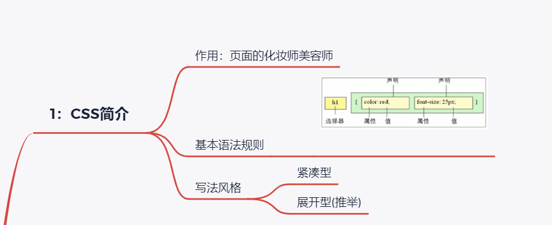
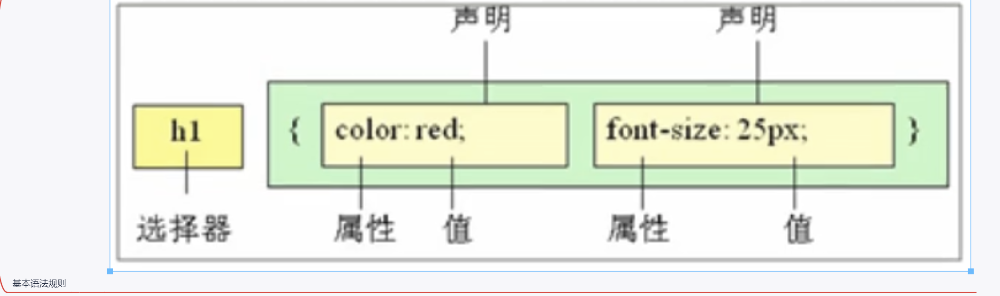
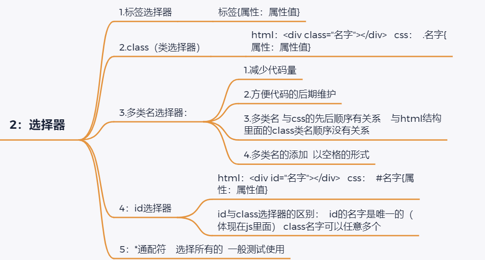
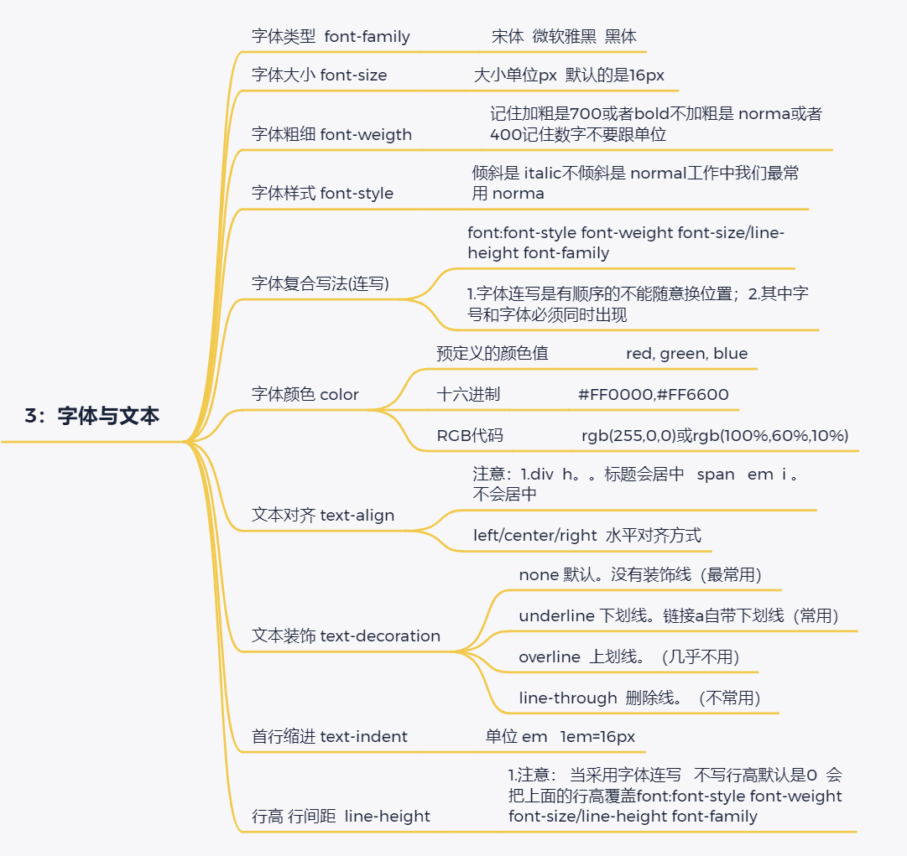
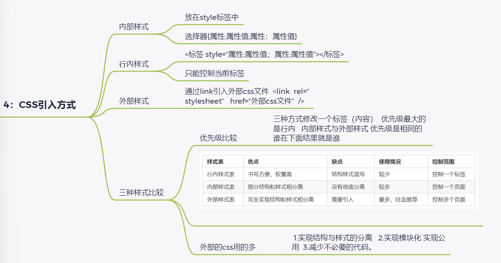
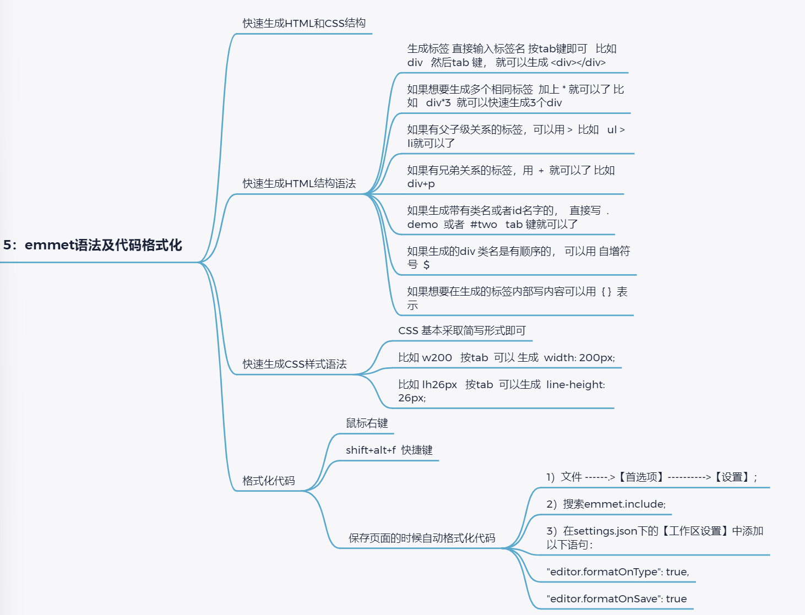
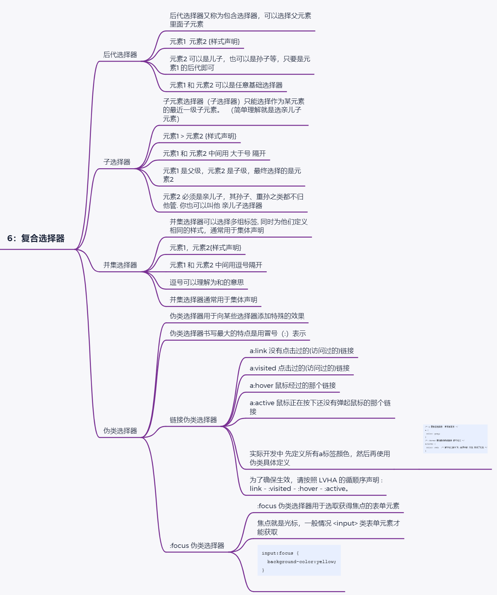
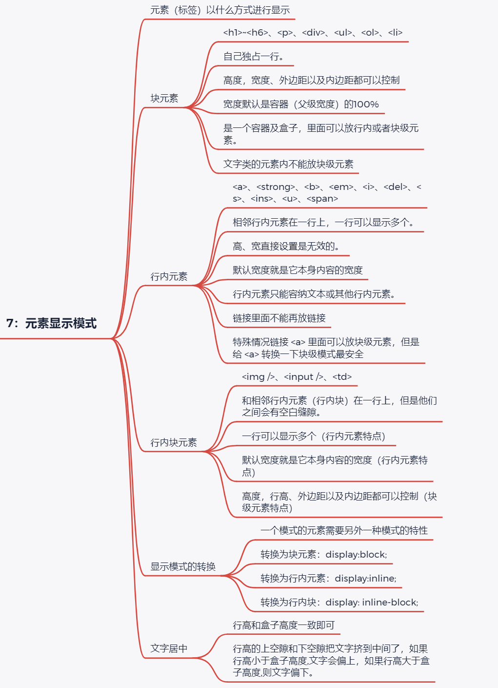
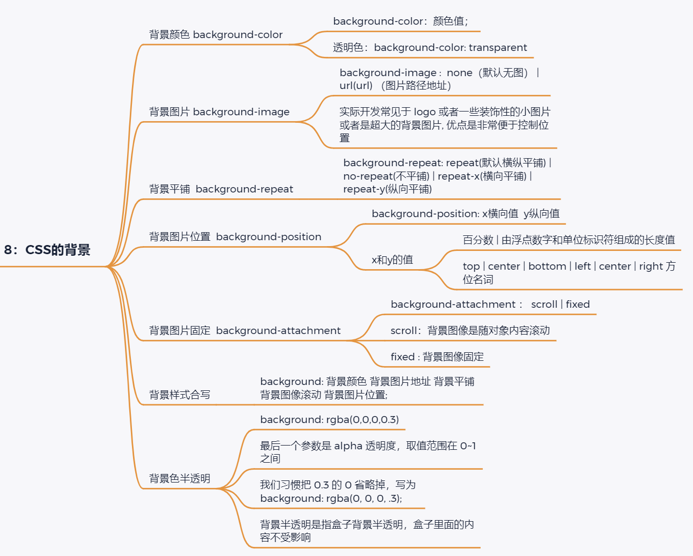

> # **CSS基础**
>

> 
>
> 


> 
>
> 
>
> **1：CSS简介**
> 	作用：页面的化妆师美容师
> 	基本语法规则
> 		

```html
写法风格
	紧凑型
	展开型(推举)
```




```html
2：选择器**
	`1.标签选择器`
		标签{属性：属性值}
	`2.class（类选择器）`
		html：<div class="名字"></div>   css：  .名字{属性：属性值}
	`3.多类名选择器：`  
		1.减少代码量
		2.方便代码的后期维护
		3.多类名 与css的先后顺序有关系    与html结构里面的class类名顺序没有关系
		4.多类名的添加  以空格的形式
	`4：id选择器`
		html：<div id="名字"></div>   css：  #名字{属性：属性值}
		id与class选择器的区别：  id的名字是唯一的（体现在js里面） class名字可以任意多个
	`5：*通配符`    选择所有的  一般测试使用


```


> 
>
> 
>
> **3：字体与文本**
> 	`字体类型  font-family`
> 		 宋体  微软雅黑  黑体
> 	`字体大小 font-size`  
> 		大小单位px  默认的是16px 
> 	`字体粗细 font-weigth`
> 		记住加粗是700或者bold不加粗是 norma或者400记住数字不要跟单位
> 	`字体样式 font-style`
> 		倾斜是 italic不倾斜是 normal工作中我们最常用 norma
> 	`字体复合写法(连写)`
> 		font:font-style font-weight font-size/line-height font-family
> 		1.字体连写是有顺序的不能随意换位置；2.其中字号和字体必须同时出现
> 	`字体颜色 color`
> 		预定义的颜色值
> 			red, green, blue
> 		十六进制
> 			#FF0000,#FF6600
> 		RGB代码
> 			rgb(255,0,0)或rgb(100%,60%,10%)
> 	`文本对齐 text-align`
> 		注意：1.div  h。。标题会居中   span   em  i 。不会居中
> 		left/center/right  水平对齐方式
> 	`文本装饰 text-decoration`
> 		none 默认。没有装饰线（最常用）
> 		underline 下划线。链接a自带下划线（常用）
> 		overline  上划线。（几乎不用）
> 		line-through  删除线。（不常用）
> 	`首行缩进 text-indent`
> 		单位 em   1em=16px
> 	`行高 行间距  line-height`
> 		1.注意： 当采用字体连写   不写行高默认是0  会把上面的行高覆盖font:font-style font-weight font-size/line-height font-family  

> 
>
> 
>
> > ```html
> > **4：CSS引入方式**
> > 	`内部样式`
> > 		放在style标签中
> > 		选择器{属性:属性值;属性：属性值}
> > 	`行内样式`
> > 		<标签 style="属性:属性值；属性:属性值"></标签>
> > 		只能控制当前标签
> > 	`外部样式`
> > 		通过link引入外部css文件  <link  rel="stylesheet"   href="外部css文件"  />
> > 	`三种样式比较`
> > 		优先级比较
> > 			三种方式修改一个标签（内容）  优先级最大的是行内   内部样式与外部样式 优先级是相同的   谁在下面结果就是谁
> > ```
> >
> > 

		外部的css用的多
			 1.实现结构与样式的分离   2.实现模块化 实现公用  3.减少不必要的代码。

> 
>
> **5：emmet语法及代码格式化**
> 	`快速生成HTML和CSS结构`
> 	`快速生成HTML结构语法`
> 		生成标签 直接输入标签名 按tab键即可   比如  div   然后tab 键， 就可以生成 <div></div>
> 		如果想要生成多个相同标签  加上 * 就可以了 比如   div*3  就可以快速生成3个div
> 		如果有父子级关系的标签，可以用 >  比如   ul > li就可以了
> 		如果有兄弟关系的标签，用  +  就可以了 比如 div+p  
> 		如果生成带有类名或者id名字的，  直接写  .demo  或者  #two   tab 键就可以了
> 		如果生成的div 类名是有顺序的， 可以用 自增符号  $ 
> 		如果想要在生成的标签内部写内容可以用  { }  表示
> 	`快速生成CSS样式语法`
> 		CSS 基本采取简写形式即可
> 		比如 w200   按tab  可以 生成  width: 200px;
> 		比如 lh26px   按tab  可以生成  line-height: 26px;
> 	`格式化代码`
> 		鼠标右键
> 		shift+alt+f  快捷键
> 		 保存页面的时候自动格式化代码
> 			1）文件 ------.>【首选项】---------->【设置】；
> 			2）搜索emmet.include;
> 			3）在settings.json下的【工作区设置】中添加以下语句：
> 			"editor.formatOnType": true,
> 			"editor.formatOnSave": true

> 
>
> 
>
> **6：复合选择器**
> 	`后代选择器`
> 		后代选择器又称为包含选择器，可以选择父元素里面子元素
> 		元素1  元素2 {样式声明}
> 		元素2 可以是儿子，也可以是孙子等，只要是元素1 的后代即可
> 		元素1 和 元素2 可以是任意基础选择器
> 	`子选择器`
> 		子元素选择器（子选择器）只能选择作为某元素的最近一级子元素。		（简单理解就是选亲儿子元素）
> 		元素1 > 元素2 {样式声明}
> 		元素1 和 元素2 中间用 大于号 隔开
> 		元素1 是父级，元素2 是子级，最终选择的是元素2
> 		元素2 必须是亲儿子，其孙子、重孙之类都不归他管. 你也可以叫他 亲儿子选择器
> 	`并集选择器`
> 		并集选择器可以选择多组标签, 同时为他们定义相同的样式，通常用于集体声明
> 		元素1，元素2{样式声明}
> 		元素1 和 元素2 中间用逗号隔开
> 		逗号可以理解为和的意思
> 		并集选择器通常用于集体声明
> 	`伪类选择器`
> 		伪类选择器用于向某些选择器添加特殊的效果
> 		伪类选择器书写最大的特点是用冒号（:）表示
> 		`链接伪类选择器`
> 			a:link	没有点击过的(访问过的)链接
> 			a:visited	点击过的(访问过的)链接
> 			a:hover	鼠标经过的那个链接
> 			a:active	鼠标正在按下还没有弹起鼠标的那个链接
> 			实际开发中 先定义所有a标签颜色，然后再使用伪类具体定义
> 				

```html
		为了确保生效，请按照 LVHA 的循顺序声明 :link－:visited－:hover－:active。
	:focus 伪类选择器
		:focus 伪类选择器用于选取获得焦点的表单元素
		焦点就是光标，一般情况 <input> 类表单元素才能获取
```

> 
>
> 
>
> 
>
> **7：元素显示模式**
> 	`元素（标签）以什么方式进行显示`
> 	`块元素`
>
> ```html
> 	<h1>~<h6>、<p>、<div>、<ul>、<ol>、<li>
> 	自己独占一行。
> 	高度，宽度、外边距以及内边距都可以控制
> 	宽度默认是容器（父级宽度）的100%
> 	是一个容器及盒子，里面可以放行内或者块级元素。
> 	文字类的元素内不能放块级元素
> 行内元素
> 	<a>、<strong>、<b>、<em>、<i>、<del>、<s>、<ins>、<u>、<span>
> 	相邻行内元素在一行上，一行可以显示多个。
> 	高、宽直接设置是无效的。
> 	默认宽度就是它本身内容的宽度
> 	行内元素只能容纳文本或其他行内元素。
> 	链接里面不能再放链接
> 	特殊情况链接 <a> 里面可以放块级元素，但是给 <a> 转换一下块级模式最安全
> 行内块元素
> 	、<input />、<td>
> 	和相邻行内元素（行内块）在一行上，但是他们之间会有空白缝隙。
> 	一行可以显示多个（行内元素特点）
> 	默认宽度就是它本身内容的宽度（行内元素特点）
> 	高度，行高、外边距以及内边距都可以控制（块级元素特点）
> 显示模式的转换
> 	一个模式的元素需要另外一种模式的特性
> 	转换为块元素：display:block;
> 	转换为行内元素：display:inline;
> 	转换为行内块：display: inline-block;
> 文字居中
> 	行高和盒子高度一致即可
> 	行高的上空隙和下空隙把文字挤到中间了，如果行高小于盒子高度,文字会偏上，如果行高大于盒子高度,则文字偏下。
> ```
>
> 


> 
>
> **8：CSS的背景**
> 	`背景颜色 background-color`
> 		background-color：颜色值；
> 		透明色：background-color: transparent
> 	`背景图片 background-image`
> 		background-image :  none（默认无图） |  url(url) （图片路径地址）
> 		实际开发常见于 logo 或者一些装饰性的小图片或者是超大的背景图片, 优点是非常便于控制位置
> 	`背景平铺  background-repeat`
> 		background-repeat: repeat(默认横纵平铺) | no-repeat(不平铺) | repeat-x(横向平铺) | repeat-y(纵向平铺)
> 	背景图片位置  background-position
> 		background-position: x横向值  y纵向值
> 		`x和y的值`
> 			百分数 | 由浮点数字和单位标识符组成的长度值
> 			top | center | bottom | left | center | right 方位名词
> 	`背景图片固定  background-attachment`
> 		background-attachment ： scroll | fixed
> 		scroll：背景图像是随对象内容滚动
> 		fixed : 背景图像固定
> 	`背景样式合写`
> 		background: 背景颜色 背景图片地址 背景平铺 背景图像滚动 背景图片位置;
> 	`背景色半透明`
> 		background: rgba(0,0,0,0.3)
> 		最后一个参数是 alpha 透明度，取值范围在 0~1之间
> 		我们习惯把 0.3 的 0 省略掉，写为 background: rgba(0, 0, 0, .3);
> 		背景半透明是指盒子背景半透明，盒子里面的内容不受影响

