> # **CSS进阶**
>

> 
>
> 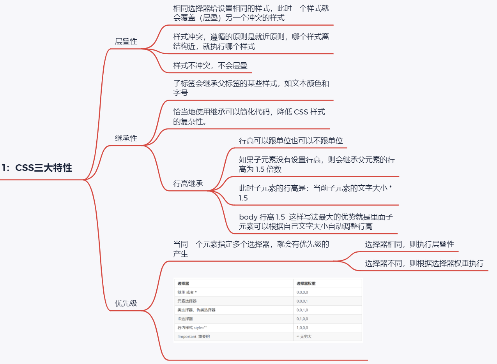
>
> **1：CSS三大特性**
> 	`层叠性`
>
> ```html
> 		相同选择器给设置相同的样式，此时一个样式就会覆盖（层叠）另一个冲突的样式
> 		样式冲突，遵循的原则是就近原则，哪个样式离结构近，就执行哪个样式
> 		样式不冲突，不会层叠
> ```
>
> ​	`继承性`
> ​		
>
> ```html
> 子标签会继承父标签的某些样式，如文本颜色和字号
> 		恰当地使用继承可以简化代码，降低 CSS 样式的复杂性。
> ```
>
> ​		`行高继承`
> ​	
>
> ```html
> 		行高可以跟单位也可以不跟单位
> 			如果子元素没有设置行高，则会继承父元素的行高为 1.5 倍数
> 			此时子元素的行高是：当前子元素的文字大小 * 1.5
> 			body 行高 1.5  这样写法最大的优势就是里面子元素可以根据自己文字大小自动调整行高
> ```
>
> ​	`优先级`
>
> 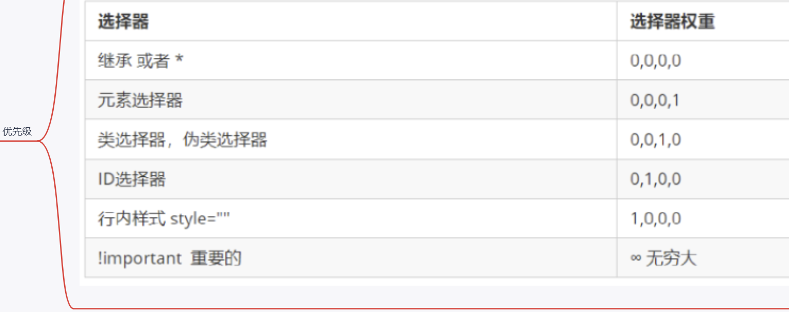
>
> ​		`当同一个元素指定多个选择器，就会有优先级的产生`
> ​		
>
> ```html
> 	选择器相同，则执行层叠性
> 			选择器不同，则根据选择器权重执行
> 		
> ```
>
> 

> **2：盒子模型 ***
>
> 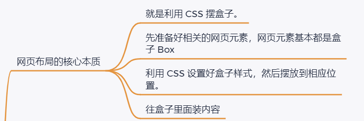
>
> ​	`网页布局的核心本质`
> ​		
>
> ```html
> 就是利用 CSS 摆盒子。
> 		先准备好相关的网页元素，网页元素基本都是盒子 Box 
> 		利用 CSS 设置好盒子样式，然后摆放到相应位置。
> 		往盒子里面装内容
> ```
>
> 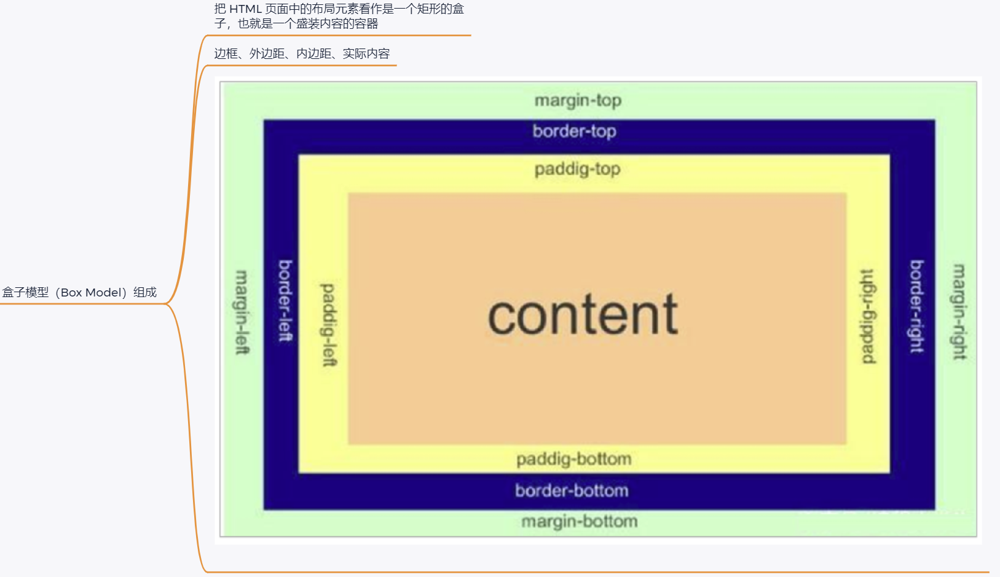
>
> ​	`盒子模型（Box Model）组成`
> ​		把 HTML 页面中的布局元素看作是一个矩形的盒子，也就是一个盛装内容的容器
> ​		边框、外边距、内边距、实际内容
> ​		


> 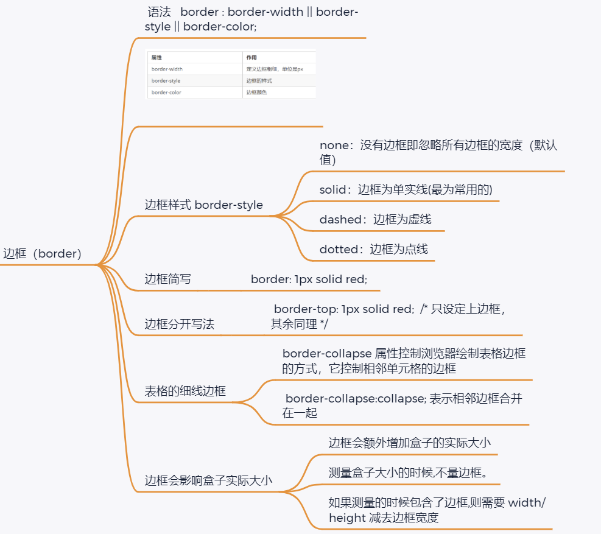

> ```html
> 
> 
> 边框（border）
> 	 语法   border : border-width || border-style || border-color;  
> 	
> 	边框样式 border-style
> 		none：没有边框即忽略所有边框的宽度（默认值）
> 		solid：边框为单实线(最为常用的)
> 		dashed：边框为虚线  
> 		dotted：边框为点线
> 	边框简写
> 		 border: 1px solid red;  
> 	边框分开写法
> 		 border-top: 1px solid red;  /* 只设定上边框， 其余同理 */   
> 	表格的细线边框
> 		border-collapse 属性控制浏览器绘制表格边框的方式，它控制相邻单元格的边框
> 		 border-collapse:collapse; 表示相邻边框合并在一起
> 	边框会影响盒子实际大小
> 		边框会额外增加盒子的实际大小
> 		测量盒子大小的时候,不量边框。
> 		如果测量的时候包含了边框,则需要 width/height 减去边框宽度
> 内边距（padding）
> 	padding 属性用于设置内边距，即边框与内容之间的距离。
> ```
>


​		


> 
>
> 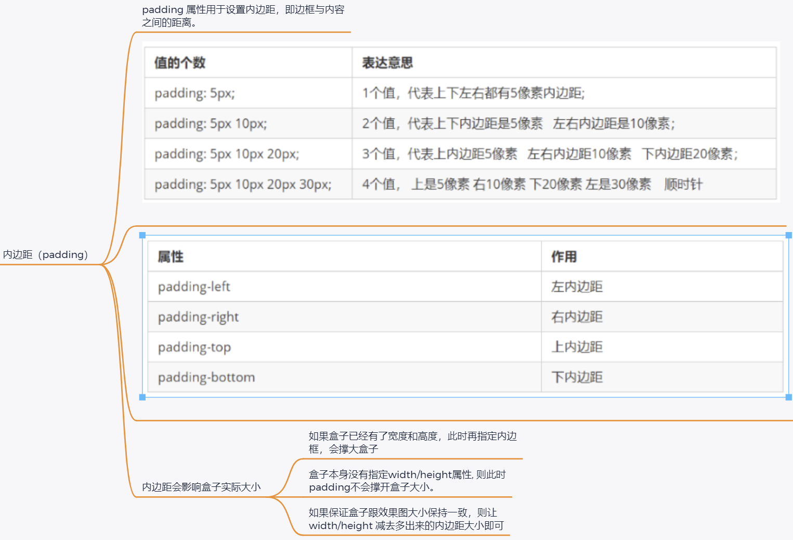
>
> **`内边距会影响盒子实际大小`**
> 		
>
> ```html
> 	如果盒子已经有了宽度和高度，此时再指定内边框，会撑大盒子
> 			盒子本身没有指定width/height属性, 则此时padding不会撑开盒子大小。
> 			如果保证盒子跟效果图大小保持一致，则让 width/height 减去多出来的内边距大小即可
> ```
>
> 


> ```html
> 外边距（margin）
> 	`margin 属性用于设置外边距，即控制盒子和盒子之间的距离`
> 外边距可以让块级盒子水平居中的两个条件
> 	盒子必须指定了宽度（width）。
> 	盒子左右的外边距都设置为 auto 。
> 	下三种都可以
> ```
>
> ```html
> margin-left: auto;   margin-right: auto;
> margin: auto;
> margin: 0 auto;
> ```
>
> ​	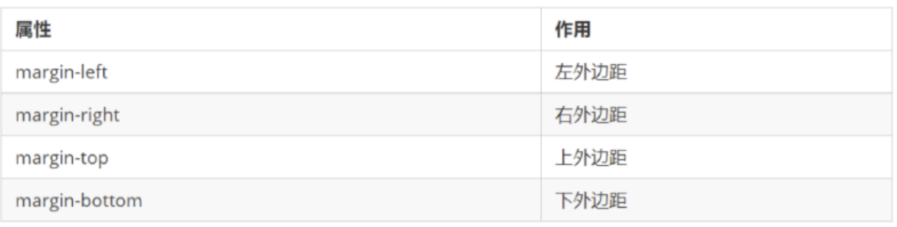


> 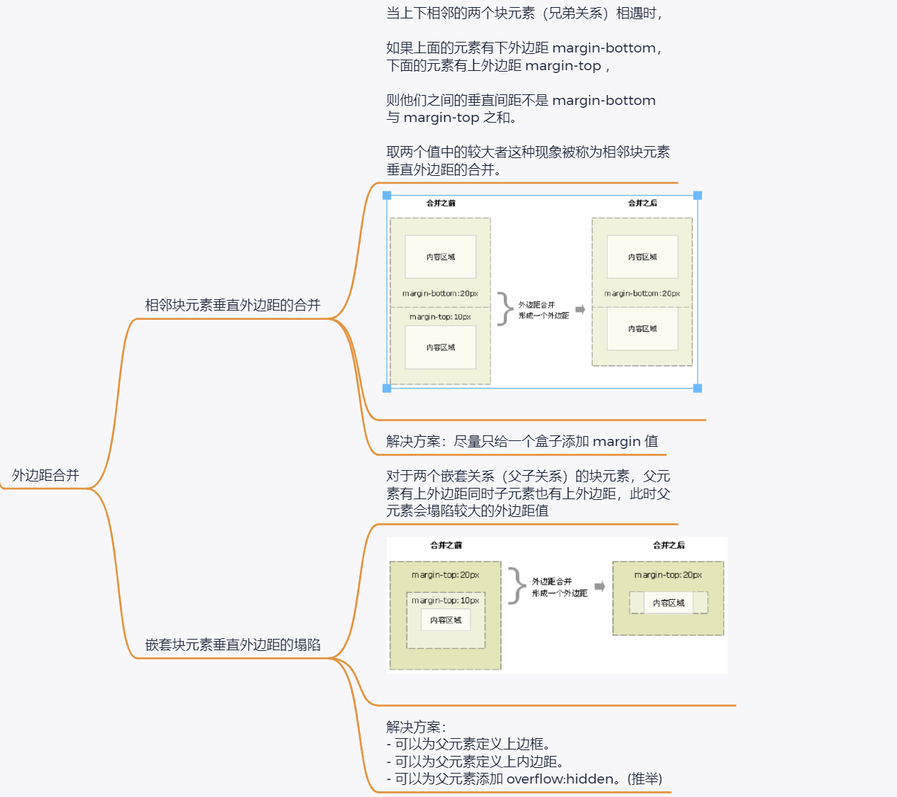
>
> 
>
> ​		`**外边距合并**`
> ​			`相邻块元素垂直外边距的合并`
> ​			
>
> ```html
> 	当上下相邻的两个块元素（兄弟关系）相遇时，
> 
> 如果上面的元素有下外边距 margin-bottom，下面的元素有上外边距 margin-top ，
> 
> 则他们之间的垂直间距不是 margin-bottom 与 margin-top 之和。
> 
> 取两个值中的较大者这种现象被称为相邻块元素垂直外边距的合并.
> 解决方案：尽量只给一个盒子添加 margin 值
> ```
>
> 
>
> `嵌套块元素垂直外边距的塌陷`
> 对于两个嵌套关系（父子关系）的块元素，父元素有上外边距同时子元素也有上外边距，此时父元素会塌陷较大的外边距值	
> 解决方案：
>
> - 可以为父元素定义上边框。
> - 可以为父元素定义上内边距。
> - 可以为父元素添加 overflow:hidden。(推举)		
>
> ​	


> 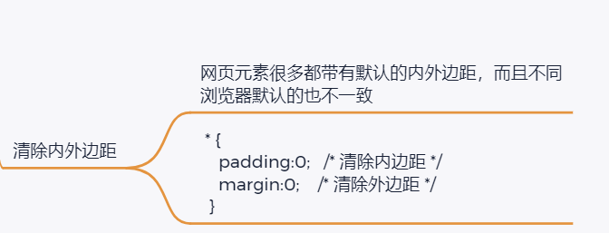
>
> **`清除内外边距`**
> 	
>
> ```html
> 网页元素很多都带有默认的内外边距，而且不同浏览器默认的也不一致
> 
>   * {
>     padding:0;   /* 清除内边距 */
>       margin:0;    /* 清除外边距 */
>     }
> ```
>
> 

> 
>
> 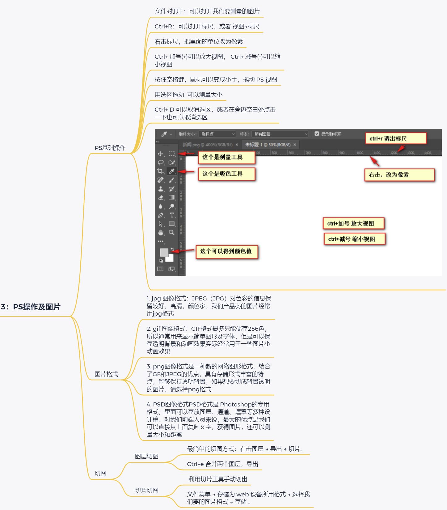
>
> ```html
> **3：PS操作及图片**
> 	`**PS基础操作**`
> 		文件→打开 ：可以打开我们要测量的图片
> 		Ctrl+R：可以打开标尺，或者 视图→标尺
> 		右击标尺，把里面的单位改为像素
> 		Ctrl+ 加号(+)可以放大视图， Ctrl+ 减号(-)可以缩小视图
> 		按住空格键，鼠标可以变成小手，拖动 PS 视图
> 		用选区拖动  可以测量大小
> 		Ctrl+ D 可以取消选区，或者在旁边空白处点击一下也可以取消选区
> 		图片格式
> 	1. jpg 图像格式：JPEG（JPG）对色彩的信息保留较好，高清，颜色多，我们产品类的图片经常用jpg格式
> 	2. gif 图像格式：GIF格式最多只能储存256色，所以通常用来显示简单图形及字体，但是可以保存透明背景和动画效果实际经常用于一些图片小动画效果
> 	3. png图像格式是一种新的网络图形格式，结合了GF和JPEG的优点，具有存储形式丰富的特点，能够保持透明背景，如果想要切成背景透明的图片，请选择png格式
> 	4. PSD图像格式PSD格式是 Photoshop的专用格式，里面可以存放图层、通道、遮罩等多种设计稿。对我们前端人员来说，最大的优点是我们可以直接从上面复制文字，获得图片，还可以测量大小和距离
> 切图
> 	图层切图
> 		最简单的切图方式：右击图层 → 导出 → 切片。
> 		Ctrl+e 合并两个图层，导出
> 	切片切图
> 		 利用切片工具手动划出
> 		文件菜单 → 存储为 web 设备所用格式 → 选择我们要的图片格式 → 存储 。
> ```
>
> 


> 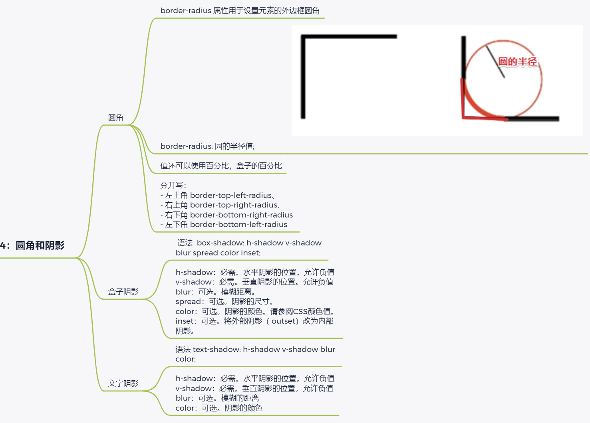
>
> **4：圆角和阴影**
> 	`**圆角**`
>
> ```html
> 		border-radius 属性用于设置元素的外边框圆角
> 		border-radius: 园的半径值;
> 		值还可以使用百分比，盒子的百分比
> ```
>
> `分开写：`
>
> - ```html
>   - 左上角 border-top-left-radius、
>   - 右上角 border-top-right-radius、
>   - 右下角 border-bottom-right-radius 
>   - 左下角 border-bottom-left-radius
>   ```
>
>   `盒子阴影`
>   	 
>
>   ```
>   语法  box-shadow: h-shadow v-shadow blur spread color inset; 
>   	h-shadow：必需。水平阴影的位置。允许负值
>   v-shadow：必需。垂直阴影的位置。允许负值
>   blur：可选。模糊距离。
>   spread：可选。阴影的尺寸。
>   color：可选。阴影的颜色。请参阅CSS颜色值。
>   inset：可选。将外部阴影（ outset）改为内部阴影。
>   ```
>
>   `**文字阴影**`
>
>   ```
>   	语法 text-shadow: h-shadow v-shadow blur color;
>   	h-shadow：必需。水平阴影的位置。允许负值
>   v-shadow：必需。垂直阴影的位置。允许负值
>   blur：可选。模糊的距离
>   color：可选。阴影的颜色
>   ```
>
>   


> 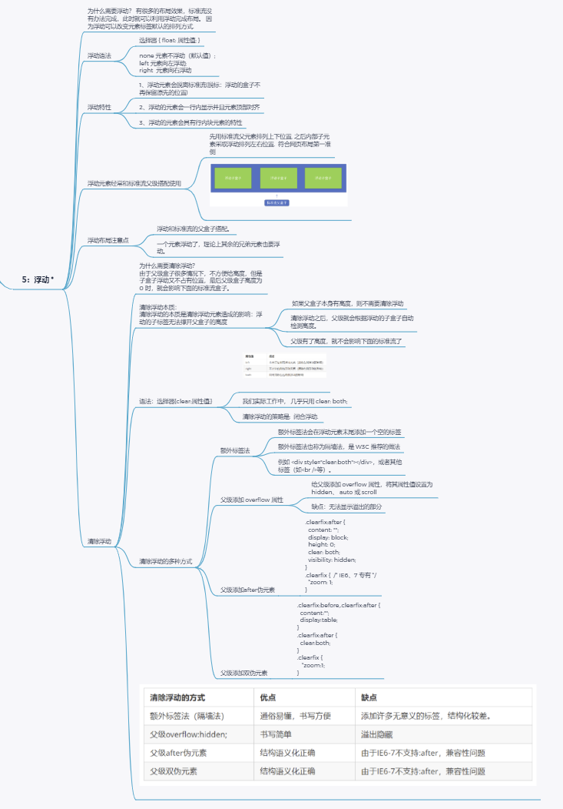
>
> **5：浮动 ***
> 	为什么需要浮动？ 有很多的布局效果，标准流没有办法完成，此时就可以利用浮动完成布局。 因为浮动可以改变元素标签默认的排列方式.
> 	`**浮动语法**`
>
> ```html
> 		none 元素不浮动（默认值）;
> left 元素向左浮动;
> right  元素向右浮动
> ```
>
> ​	`浮动特性`
>
> ```html
> 	1、浮动元素会脱离标准流(脱标：浮动的盒子不再保留原先的位置)
> 		2、浮动的元素会一行内显示并且元素顶部对齐
> 		3、浮动的元素会具有行内块元素的特性
> ```
>
> ​	`浮动元素经常和标准流父级搭配使用`
>
> ```html
> 		先用标准流父元素排列上下位置, 之后内部子元素采取浮动排列左右位置.  符合网页布局第一准侧
> ```
>
> `浮动布局注意点`
>
> ```html
> 	浮动和标准流的父盒子搭配。
> 	一个元素浮动了，理论上其余的兄弟元素也要浮动。
> ```
>
> **清除浮动**
>
> 	为什么需要清除浮动？
> 	
> 	由于父级盒子很多情况下，不方便给高度，但是子盒子浮动又不占有位置，最后父级盒子高度为 0 时，就会影响下面的标准流盒子。
> `清除浮动本质：`
>
> `清除浮动的本质是清除浮动元素造成的影响：浮动的子标签无法撑开父盒子的高度`
>
> ```html
> 如果父盒子本身有高度，则不需要清除浮动
> 清除浮动之后，父级就会根据浮动的子盒子自动检测高度。
> 父级有了高度，就不会影响下面的标准流了
> ```
>
> `语法：选择器{clear:属性值;}` 
>
> 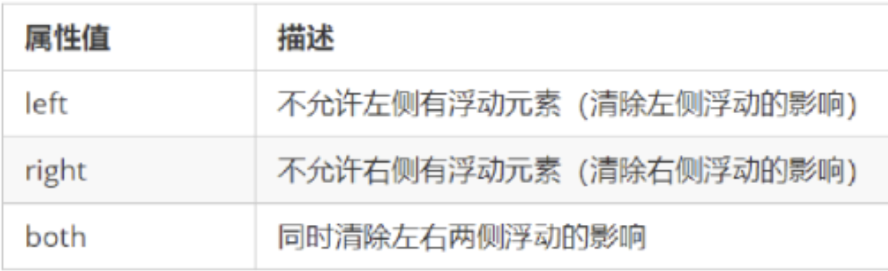
>
> ```
> 我们实际工作中， 几乎只用 clear: both;
> 清除浮动的策略是:  闭合浮动. 
> ```
>
> `清除浮动的多种方式`
> 		`额外标签法`
>
> ```html
> 			额外标签法会在浮动元素末尾添加一个空的标签
> 			额外标签法也称为隔墙法，是 W3C 推荐的做法
> 			例如 <div style="clear:both"></div>，或者其他标签（如<br />等）。
> ```
>
> ​		`父级添加 overflow 属性`
>
> ```html
> 给父级添加 overflow 属性，将其属性值设置为 hidden、 auto 或 scroll 
> 			缺点：无法显示溢出的部分
> ```
>
> ​		`父级添加after伪元素`
>
> ```
>  .clearfix:after { 
> 
> content: ""; 
>    display: block; 
>    height: 0; 
>    clear: both; 
>    visibility: hidden;  
>  } 
> 
>  .clearfix {  /* IE6、7 专有 */ 
>    *zoom: 1;
>  }  
> ```
>
> ​		
>
> `父级添加双伪元素`
>
> ```
> 			 .clearfix:before,.clearfix:after {
>    content:"";
>    display:table; 
>  }
>  .clearfix:after {
>    clear:both;
>  }
>  .clearfix {
>     *zoom:1;
>  }  
> ```
>
> 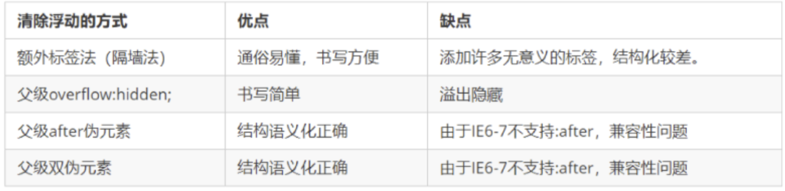		
>
> 


> 
>
> 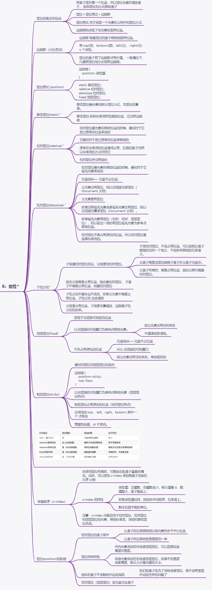
>
> **6：定位 ***
> 	`定位的概念和组成`
>
> ```html
> 将盒子定在某一个位置，所以定位也是在摆放盒子， 按照定位的方式移动盒子
> 定位 = 定位模式 + 边偏移
> 定位模式 用于指定一个元素在文档中的定位方式
> 边偏移则决定了该元素的最终位置。
> ```
>
> `边偏移（方位名词）`
>
> ```html
> 	边偏移 就是定位的盒子移动到最终位置。
> 	有 top(顶)、bottom(底)、left(左)、 right(右)  4 个属性。
> 	定位的盒子有了边偏移才有价值。 一般情况下，凡是有定位地方必定有边偏移。
> ```
>
> `定位模式 (position)`
>
> ```html
> 选择器 { 
>     position: 属性值; 
> }
> static 静态定位；
> relative 相对定位；
> absolute 绝对定位；
> fixed 固定定位；
> ```
>
> `相对定位(relative) *` 
>
> ```html
> 相对定位是元素在移动位置的时候，是相对于它自己原来的位置来说的
> 它是相对于自己原来的位置来移动的
> 原来在标准流的位置继续占有，后面的盒子仍然以标准流的方式对待它
> 相对定位并没有脱标
> ```
>
> `绝对定位(absolute) *` 
>
> ```html
> 绝对定位是元素在移动位置的时候，是相对于它祖先元素来说的
> 完全脱标—— 完全不占位置；
> 父元素没有定位，则以浏览器为准定位（Document 文档）
> 父元素要有定位
> 如果没有祖先元素或者祖先元素没有定位，则以浏览器为基准定位（Document 文档）。
> 如果祖先元素有定位（相对、绝对、固定定位），则以最近一级的有定位祖先元素为参考点移动位置。
> 绝对定位不再占有原先的位置。所以绝对定位是脱离标准流的。
> ```
>
> `子绝父相 *`
>
> ```html
> 子级是绝对定位的话，父级要用相对定位。
> 子级绝对定位，不会占有位置，可以放到父盒子里面的任何一个地方，不会影响其他的兄弟盒子。
> 父盒子需要加定位限制子盒子在父盒子内显示。
> 父盒子布局时，需要占有位置，因此父亲只能是相对定位。
> 因为父级需要占有位置，因此是相对定位， 子盒子不需要占有位置，则是绝对定位
> 子绝父相不是永远不变的，如果父元素不需要占有位置，子绝父绝 也会遇到
> 父级要占有位置，子级要任意摆放，这就是子绝父相的由来。
> ```
>
> `固定定位(fixed)` 
>
> ```html
> 	固定于浏览器可视区的位置
> 		以浏览器的可视窗口为参照点移动元素。
> 			跟父元素没有任何关系
> 			不随滚动条滚动。
> 		不在占有原先的位置
> 			完全脱标—— 完全不占位置
> 			只认 浏览器的可视窗口
> 			跟父元素没有任何关系；单独使用的
> ```
>
> 
>
> `粘性定位(sticky)`
>
> ```html
> 是相对定位和固定定位的混合
> 	选择器 { 
>  position: sticky; 
>  top: 10px; 
> 
>  }
> 以浏览器的可视窗口为参照点移动元素（固定定位特点）
> 粘性定位占有原先的位置（相对定位特点）
> 必须添加 top 、left、right、bottom 其中一个 才有效
> 兼容性较差，IE 不支持。
> ```
>
> ​	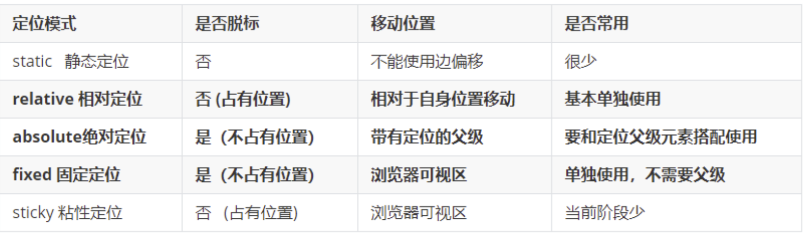
>
>  `堆叠顺序（z-index）`
>
> ```html
> 在使用定位布局时，可能会出现盒子重叠的情况。此时，可以使用 z-index 来控制盒子的前后次序 (z轴)
> `z-index 的特性`
> 属性值：正整数、负整数或 0，默认值是 0，数值越大，盒子越靠上；
> 如果属性值相同，则按照书写顺序，后来居上；
> 数字后面不能加单位。
> 注意：z-index 只能应用于相对定位、绝对定位和固定定位的元素，其他标准流、浮动和静态定位无效。
> ```
>
> `定位(position)的拓展`
>
> ```html
> 	**绝对定位的盒子居中**
> 		让盒子的左侧移动到父级元素的水平中心位置
> 		让盒子向左移动自身宽度的一半
> 	**定位特殊特性**
> 		行内元素添加绝对或者固定定位，可以直接设置高度和宽度。
> 		块级元素添加绝对或者固定定位，如果不给宽度或者高度，默认大小是内容的大小。
> 	**脱标的盒子不会触发外边距塌陷**
> 		我们给盒子改为了浮动或者定位，就不会有垂直外边距合并的问题了
> 	**绝对定位**（固定定位）会完全压住盒子
> ```


​	


> 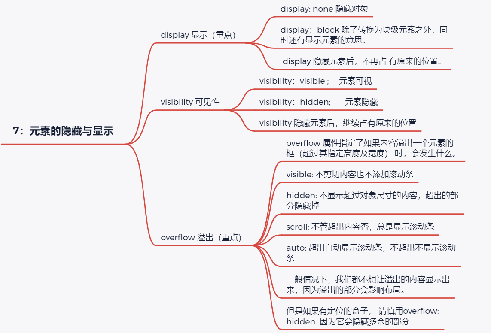
>
> 
>
> **7：元素的隐藏与显示**11111111111
> 	`display 显示（重点）`
>
> ```html
> display: none 隐藏对象
> display：block 除了转换为块级元素之外，同时还有显示元素的意思。
> display 隐藏元素后，不再占 有原来的位置。
> ```
>
> ​	`visibility 可见性`
>
> ```html
> visibility：visible ; 　元素可视
> visibility：hidden; 　  元素隐藏
> visibility 隐藏元素后，继续占有原来的位置
> ```
>
> ​	`overflow 溢出（重点）`
>
> ```html
> overflow 属性指定了如果内容溢出一个元素的框（超过其指定高度及宽度） 时，会发生什么。
> visible: 不剪切内容也不添加滚动条
> hidden: 不显示超过对象尺寸的内容，超出的部分隐藏掉
> scroll: 不管超出内容否，总是显示滚动条
> auto: 超出自动显示滚动条，不超出不显示滚动条
> 一般情况下，我们都不想让溢出的内容显示出来，因为溢出的部分会影响布局。
> 但是如果有定位的盒子， 请慎用overflow:hidden  因为它会隐藏多余的部分
> ```
>
> 

> 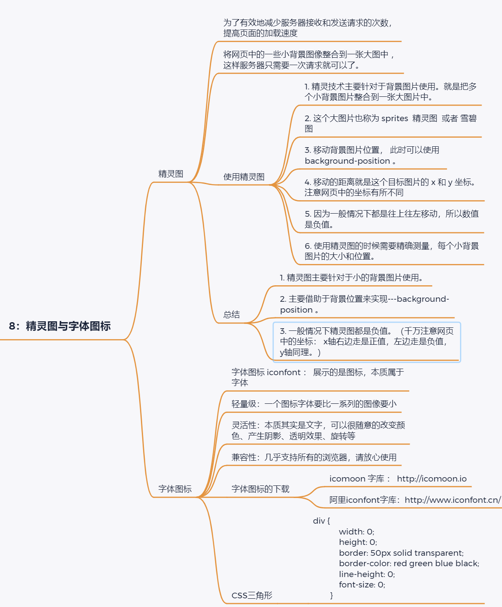
>
> **8：精灵图与字体图标**
> 	`精灵图`
>
> ```html
> 为了有效地减少服务器接收和发送请求的次数，提高页面的加载速度
> 将网页中的一些小背景图像整合到一张大图中 ，这样服务器只需要一次请求就可以了。
> ```
>
> ​		`使用精灵图`
>
> ```html
> 精灵技术主要针对于背景图片使用。就是把多个小背景图片整合到一张大图片中。
> 
> 这个大图片也称为 sprites  精灵图  或者 雪碧图
> 
> 移动背景图片位置， 此时可以使用 background-position 。
> 
> 移动的距离就是这个目标图片的 x 和 y 坐标。注意网页中的坐标有所不同
> 
> 因为一般情况下都是往上往左移动，所以数值是负值。
> 
> 使用精灵图的时候需要精确测量，每个小背景图片的大小和位置。
> ```
>
> `总结`
>
> ```html
> 精灵图主要针对于小的背景图片使用。
> 主要借助于背景位置来实现---background-position 。
> 一般情况下精灵图都是负值。（千万注意网页中的坐标： x轴右边走是正值，左边走是负值， y轴同理。）
> ```
>
> `字体图标`
>
> ```html
> 字体图标 iconfont ： 展示的是图标，本质属于字体
> 轻量级：一个图标字体要比一系列的图像要小
> 灵活性：本质其实是文字，可以很随意的改变颜色、产生阴影、透明效果、旋转等
> 兼容性：几乎支持所有的浏览器，请放心使用
> ```
>
> `字体图标的下载`
>
> ```html
> icomoon 字库 ： http://icomoon.io
> 阿里iconfont字库：http://www.iconfont.cn/ 
> ```
>
> `CSS三角形`
>
> ```html
> div {
>   width: 0;
>   height: 0;
>   border: 50px solid transparent;
>   border-color: red green blue black;
>   line-height: 0;
>   font-size: 0;
>  	}
> ```
>
>
> 

