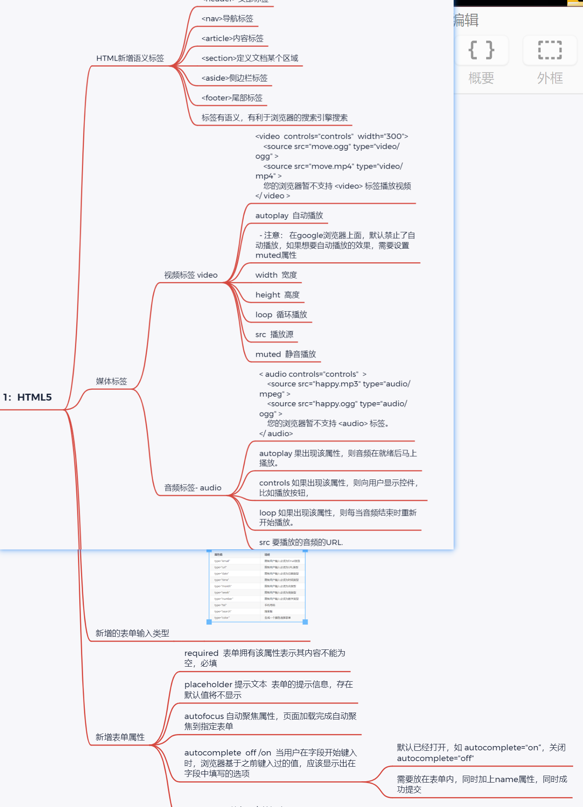
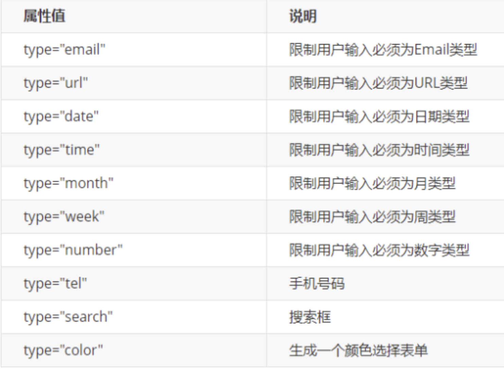
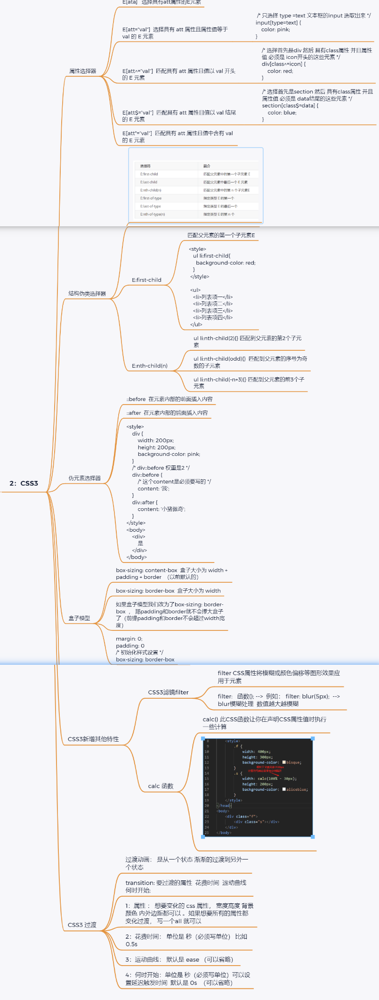
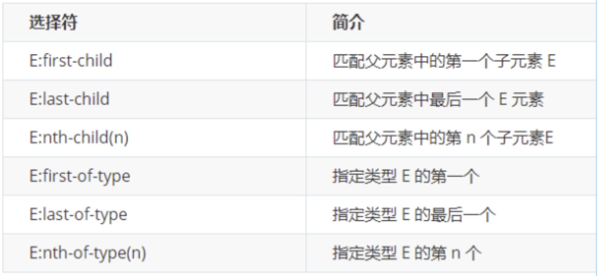

> # HTML5+CSS基础
>


> 
>
> 
>
> **1：HTML5**
> 	`HTML新增语义标签`
>
> ```html
> <header> 头部标签
> <nav>导航标签
> <article>内容标签
> <section>定义文档某个区域
> <aside>侧边栏标签
> <footer>尾部标签
> 标签有语义，有利于浏览器的搜索引擎搜索
> ```
>
> 
>
> `媒体标签`
> 	`视频标签 video`
>
> ```html
> 	<video  controls="controls"  width="300">
> 	<source src="move.ogg" type="video/ogg" >
> <source src="move.mp4" type="video/mp4" >
> 您的浏览器暂不支持 <video> 标签播放视频
>   </ video >
> autoplay  自动播放
> 
>  - 注意： 在google浏览器上面，默认禁止了自动播放，如果想要自动播放的效果，需要设置 muted属性
>    width  宽度
>    height  高度
>    loop  循环播放
>    src  播放源
>    muted  静音播放
> 
> 
> 
> 	
> ```
> 
>
>    `音频标签- audio`
>
> ```html
> < audio controls="controls"  >
>     <source src="happy.mp3" type="audio/mpeg" >
>     <source src="happy.ogg" type="audio/ogg" >
>     您的浏览器暂不支持 <audio> 标签。
> </ audio>
> 		autoplay 果出现该属性，则音频在就绪后马上搔放。
> 		controls 如果出现该属性，则向用户显示控件，比如播放按钮，
> 		loop 如果出现该属性，则每当音频结束时重新开始播放。
> 		src 要播放的音频的URL.
> ```
>
> `新增的表单输入类型`
>
> 
>
> 
>
> `新增表单属性`
>
> ```html
> required  表单拥有该属性表示其内容不能为空，必填
> 	placeholder 提示文本  表单的提示信息，存在默认值将不显示
> 	autofocus 自动聚焦属性，页面加载完成自动聚焦到指定表单
> 	`autocomplete  off /on  当用户在字段开始键入时，浏览器基于之前键入过的值，应该显示出在字段中填写的选项`
> 		默认已经打开，如 autocomplete="on“，关闭 autocomplete="off"
> 		需要放在表单内，同时加上name属性，同时成功提交
> 	multiple 可以多选文件提交
> ```
>
> 


​	

​		

> 
>
> **2：CSS3**
>
> `属性选择器`
> 		
>
> ```html
> E[ata]   选择具有att属性的E元素
> 		E[att="val"]  选择具有 att 属性且属性值等于 val 的 E 元素
> 			 /* 只选择 type =text 文本框的input 选取出来 */1111111111111
> input[type=text] {
>     color: pink;
> }
> 		E[att^="val"]  匹配具有 att 属性且值以 val 开头的 E 元素
> 			/* 选择首先是div 然后 具有class属性 并且属性值 必须是 icon开头的这些元素 */
> div[class^=icon] {
>     color: red;
> }
> 		E[att$="val"]  匹配具有 att 属性目值以 val 结尾的 E 元素
> 			/* 选择首先是section 然后 具有class属性 并且属性值 必须是 data结尾的这些元素 */
> section[class$=data] {
>     color: blue;
> }
> 		E[att*="val"]  匹配具有 att 属性且值中含有 val 的 E 元素
> ```
>
> `结构伪类选择器`
>
> 
>
> 
>
> `E:first-child`
>
>
> ```html
> 匹配父元素的第一个子元素E
> ul li:first-child{
>  background-color: red;
> }
> <ul>
>     <li>列表项一</li>
>     <li>列表项二</li>
>     <li>列表项三</li>
>     <li>列表项四</li>
>   </ul>
> 
> ```
>
> ​	`E:nth-child(n)`
>
> ```
> ul li:nth-child(2){} 匹配到父元素的第2个子元素 
> ul li:nth-child(odd){}  匹配到父元素的序号为奇数的子元素
> ul li:nth-child(-n+3){} 匹配到父元素的前3个子元素
> ```
>
> 
>
> **伪元素选择器**
>
> ```
> ::before  在元素内部的前面插入内容
> 	::after  在元素内部的后面插入内容
> 
> 	<style>
> 
> </style>
> <body>
> 
>     <div>
>         是
>     </div>
> 
> </body>
> ```
>
> ​	`**盒子模型**`
>
> ```
> box-sizing: content-box  盒子大小为 width + padding + border  （以前默认的）
> box-sizing: border-box  盒子大小为 width
> 如果盒子模型我们改为了box-sizing: border-box  ， 那padding和border就不会撑大盒子了（前提padding和border不会超过width宽度）
> margin: 0;
> padding: 0
> /* 初始化样式设置 */
> box-sizing: border-box
> ```
>
> `CSS3新增其他特性`
>
> ```
> CSS3滤镜filter
> 		filter CSS属性将模糊或颜色偏移等图形效果应用于元素
> 		filter:   函数(); -->  例如： filter: blur(5px);  -->  blur模糊处理  数值越大越模糊
> ```
>
> `calc 函数`
>
> ```
> calc() 此CSS函数让你在声明CSS属性值时执行一些计算
> ```
>
> `CSS3 过渡`
>
> ```
> 过渡动画： 是从一个状态 渐渐的过渡到另外一个状态
> transition: 要过渡的属性  花费时间  运动曲线  何时开始;
> 1：属性 ： 想要变化的 css 属性， 宽度高度 背景颜色 内外边距都可以 。如果想要所有的属性都变化过渡， 写一个all 就可以
> 2：花费时间： 单位是 秒（必须写单位） 比如 0.5s 
> 3：运动曲线： 默认是 ease （可以省略）
> 4：何时开始：单位是 秒（必须写单位）可以设置延迟触发时间  默认是 0s  （可以省略）
> ```
>
> 

