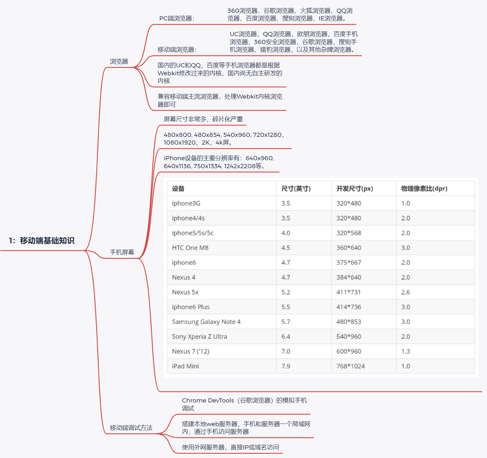
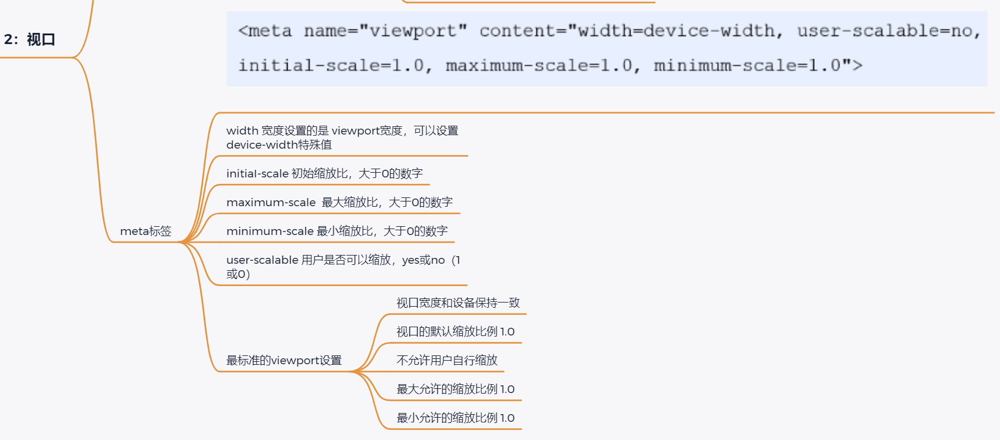
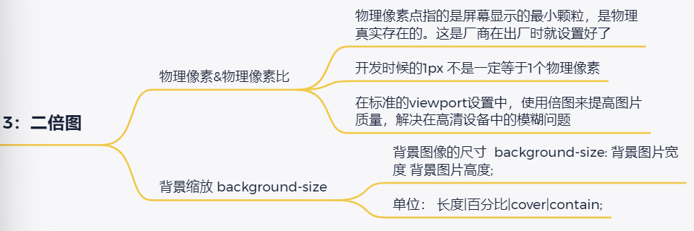
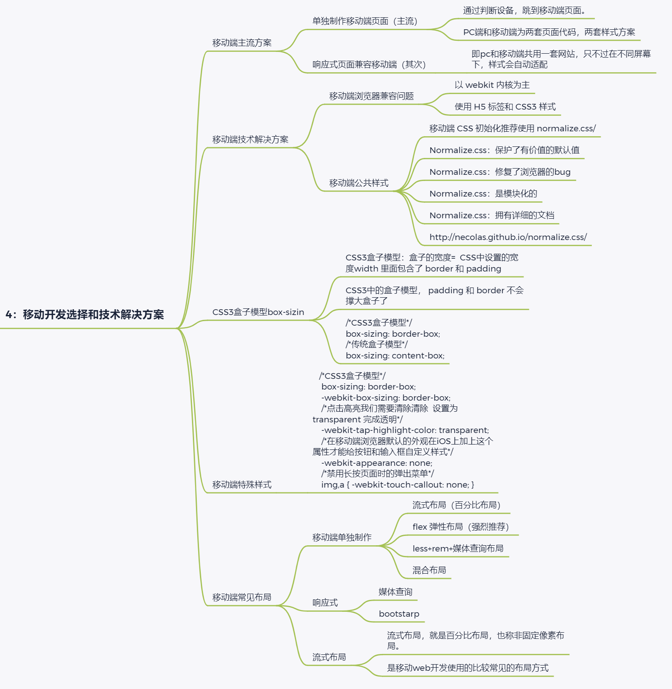
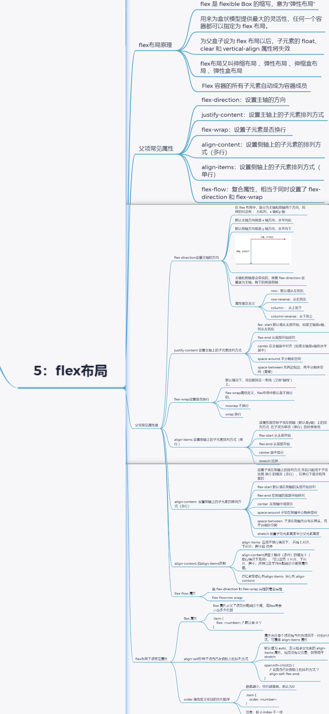

> # FLex伸缩布局
>

> 
>
> 
>
> **1：移动端基础知识**
> 	`浏览器`
>
> ```html
>  PC端浏览器：
> 360浏览器、谷歌浏览器、火狐浏览器、QQ浏览器、百度浏览器、搜狗浏览器、IE浏览器。
> 移动端浏览器：
> UC浏览器，QQ浏览器，欧朋浏览器，百度手机浏览器，360安全浏览器，谷歌浏览器，搜狗手机浏览器，猎豹浏览器，以及其他杂牌浏览器。
> 国内的UC和QQ，百度等手机浏览器都是根据Webkit修改过来的内核，国内尚无自主研发的内核
> 兼容移动端主流浏览器，处理Webkit内核浏览器即可
> 
> 
> ```
>
> ​	`手机屏幕`
>
> ```html
> 屏幕尺寸非常多，碎片化严重
> 480x800, 480x854, 540x960, 720x1280，1080x1920、2K，4k屏。
> iPhone设备的主要分辨率有：640x960, 640x1136, 750x1334, 1242x2208等。
> ```
>
> ​		`移动端调试方法`
>
> ```html
> Chrome DevTools（谷歌浏览器）的模拟手机调试
> 搭建本地web服务器，手机和服务器一个局域网内，通过手机访问服务器
> 使用外网服务器，直接IP或域名访问
> ```


> 
>
> **2：视口**
> 	`视口（viewport）就是浏览器显示页面内容的屏幕区域；分为布局视口、视觉视口和理想视口`
> 		`布局视口 layout viewport`
>
> ```html
> iOS, Android基本都将这个视口分辨率设置为 980px
> ```
>
> ​		`视觉视口 visual viewport`
>
> ```html
> 是网站的区域。
> 可以通过缩放去操作视觉视口
> 但不会影响布局视口，布局视口仍保持原来的宽度
> ```
>
> ​		`理想视口 ideal viewport`
>
> ```html
> 为了使网站在移动端有最理想的浏览和阅读宽度而设定，对设备来讲，是最理想的视口尺寸
> 需要手动添写meta视口标签通知浏览器操作
> meta视口标签的主要目的：布局视口的宽度应该与理想视口的宽度一致
> 我们开发最终会用理想视口，而理想视口就是将布局视口的宽度修改为视觉视口
> ```
>
> ​	`meta标签`
>
> ```html
> width 宽度设置的是 viewport宽度，可以设置 device-width特殊值
> initiaI-scale 初始缩放比，大于0的数字
> maximum-scale  最大缩放比，大于0的数字
> minimum-scale 最小缩放比，大于0的数字
> user-scalable 用户是否可以缩放，yes或no（1或0）
> ```
>
> ​	`最标准的viewport设置`
> ​		
>
> ```html
> 视口宽度和设备保持一致
> 视口的默认缩放比例 1.0
> 不允许用户自行缩放
> 最大允许的缩放比例 1.0
> 最小允许的缩放比例 1.0
> ```
>
> 


> 
>
> **3：二倍图**
> 	`物理像素&物理像素比`
>
> ```html
> 物理像素点指的是屏幕显示的最小颗粒，是物理真实存在的。这是厂商在出厂时就设置好了
> 开发时候的1px 不是一定等于1个物理像素
> 在标准的viewport设置中，使用倍图来提高图片质量，解决在高清设备中的模糊问题
> ```
>
> ​	`背景缩放 background-size`
>
> ```html
> 背景图像的尺寸  background-size: 背景图片宽度 背景图片高度;
> 单位： 长度|百分比|cover|contain;
> ```
>
> 

> 
>
> **4：移动开发选择和技术解决方案**
> 	`移动端主流方案`
>
> ```html
> `单独制作移动端页面（主流）`
> 通过判断设备，跳到移动端页面。
> PC端和移动端为两套页面代码，两套样式方案
> `响应式页面兼容移动端（其次）`
> 即pc和移动端共用一套网站，只不过在不同屏幕下，样式会自动适配
> ```
>
> ​	`移动端技术解决方案`	
>
> ```html
> `移动端浏览器兼容问题`
> 以 webkit 内核为主
> 使用 H5 标签和 CSS3 样式
> `移动端公共样式`
> 移动端 CSS 初始化推荐使用 normalize.css/
> Normalize.css：保护了有价值的默认值
> Normalize.css：修复了浏览器的bug
> Normalize.css：是模块化的
> Normalize.css：拥有详细的文档
> http://necolas.github.io/normalize.css/
> ```
>
> ​	`CSS3盒子模型box-sizin`
>
> ```html
> CSS3盒子模型：盒子的宽度=  CSS中设置的宽度width 里面包含了 border 和 padding 
> CSS3中的盒子模型， padding 和 border 不会撑大盒子了
> /*CSS3盒子模型*/
> box-sizing: border-box;
> /*传统盒子模型*/
> box-sizing: content-box;
> ```
>
> ​	`移动端特殊样式`
>
> ```html
>  /*CSS3盒子模型*/
>  box-sizing: border-box;
>  -webkit-box-sizing: border-box;
>  /*点击高亮我们需要清除清除  设置为transparent 完成透明*/
>  -webkit-tap-highlight-color: transparent;
>  /*在移动端浏览器默认的外观在iOS上加上这个属性才能给按钮和输入框自定义样式*/
>  -webkit-appearance: none;
>  /*禁用长按页面时的弹出菜单*/
>  img,a { -webkit-touch-callout: none; }
> ```
>
> ​	**移动端常见布局**
>
> `移动端单独制作`
>
> ```
> 流式布局（百分比布局）
> flex 弹性布局（强烈推荐）
> less+rem+媒体查询布局
> 混合布局
> ```
>
> `响应式`
>
> ```html
> 媒体查询
> bootstarp
> ```
>
> `流式布局`
>
> ```html
> 流式布局，就是百分比布局，也称非固定像素布局。
> 是移动web开发使用的比较常见的布局方式
> ```

> 
>
> 
>
> **5：flex布局**
> 	`flex布局原理`
>
> ```html
> flex 是 flexible Box 的缩写，意为"弹性布局"
> 用来为盒状模型提供最大的灵活性，任何一个容器都可以指定为 flex 布局。
> 为父盒子设为 flex 布局以后，子元素的 float、clear 和 vertical-align 属性将失效
> flex布局又叫伸缩布局 、弹性布局 、伸缩盒布局 、弹性盒布局 
>  Flex 容器的所有子元素自动成为容器成员
> ```
>
> ​	`父项常见属性`
>
> ```html
> flex-direction：设置主轴的方向
> justify-content：设置主轴上的子元素排列方式
> flex-wrap：设置子元素是否换行  
> align-content：设置侧轴上的子元素的排列方式（多行）
> align-items：设置侧轴上的子元素排列方式（单行）
> flex-flow：复合属性，相当于同时设置了 flex-direction 和 flex-wrap
> ```
>
> ​	`父项常见属性值`
>
> ```html
> `flex-direction设置主轴的方向`
> 在 flex 布局中，是分为主轴和侧轴两个方向，同样的叫法有 ： 行和列、x 轴和y 轴
> 默认主轴方向就是 x 轴方向，水平向右
> 默认侧轴方向就是 y 轴方向，水平向下
> 主轴和侧轴是会变化的，就看 flex-direction 设置谁为主轴，剩下的就是侧轴
> 
> ```
>
> `属性值及含义`
>
> ```html
> row：默认值从左到右
> row-reverse：从右到左
> column ： 从上到下
> column-reverse：从下到上
> ```
>
> `justify-content 设置主轴上的子元素排列方式`
>
> ```html
> fex- start 默认值从头部开始，如果主轴是x轴，则从左到右
> flex-end 从尾部开始排列
> center 在主轴居中对齐（如果主轴是x轴则水平居中）
> space-around 平分剩余空间
> space-between 先两边贴边，再平分剩余空间（重要）
> 
> 
> ```
>
> ​		`flex-wrap设置是否换行`
>
> ```html
> 默认情况下，项目都排在一条线（又称”轴线”）上。
> flex-wrap属性定义，flex布局中默认是不换行的。
> nowrap 不换行
> wrap 换行
> ```
>
> `align-items 设置侧轴上的子元素排列方式（单行 ）`
>
> ```html
> 该属性是控制子项在侧轴（默认是y轴）上的排列方式  在子项为单项（单行）的时候使用
> flex-start 从头部开始
> flex-end 从尾部开始
> center 居中显示
> stretch 拉伸
> ```
>
> `align-content  设置侧轴上的子元素的排列方式（多行）`
>
> ```html
> 设置子项在侧轴上的排列方式 并且只能用于子项出现 换行 的情况（多行），在单行下是没有效果的
> flex-start 默认值在侧轴的头部开始排列
> flex-end 在侧轴的尾部开始排列
> center  在侧轴中间显示
> space-around 子项在侧轴平分剩余空间
> space-between  子项在侧轴先分布在两头，再平分剩余空间
> stretch 设置子项元素高度平分父元素高度
> ```
>
> `align-content 和align-items区别`
>
> ```html
> align-items  适用于单行情况下， 只有上对齐、下对齐、居中和 拉伸
> align-content适应于换行（多行）的情况下（单行情况下无效）， 可以设置 上对齐、下齐、居中、拉伸以及平均分配剩余空间等属性值。 
> 总结就是单行找align-items  多行找 align-content
> ```
>
> `flex-flow 属性`
>
> ```html
> 是 flex-direction 和 flex-wrap 属性的复合属性
> flex-flow:row wrap;
> ```
>
> `flex布局子项常见属性`
>
> ​	`flex 属性`
>
> ```html
> 	flex 属性定义子项目分配剩余空间，用flex来表示占多少份数
> ​	.item {
> flex: <number>; /* 默认值 0 */
> }
> ```
>
>
> ​		`align-self控制子项自己在侧轴上的排列方式`
>
> ```html
> 属性允许单个项目有与其他项目不一样的对齐方式，可覆盖 align-items 属性
> 默认值为 auto，表示继承父元素的 align-items 属性，如果没有父元素，则等同于 stretch 
> span:nth-child(2) {
> /* 设置自己在侧轴上的排列方式 */
>   align-self: flex-end;
>   }
> ```
> ​		`order 属性定义项目的排列顺序`
>
> ```html
> 数值越小，排列越靠前，默认为0
> .item {
>  order: <number>;
> }
> 注意：和 z-index 不一样
> ```


​	
​	


